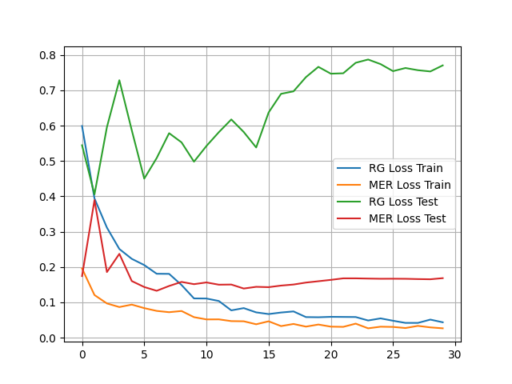
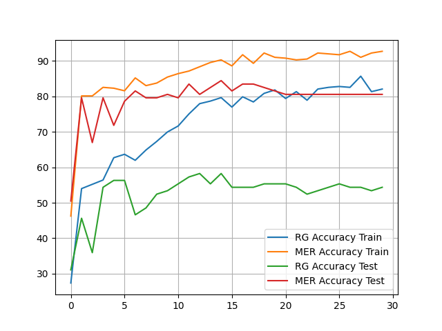

# Multi_Task_Learning_Example
A PyTorch implementation of Mixture-of-Experts, Multi-Task Learning for eye disease diagnosis.


## Objective:
Design and implement a modular deep learning system for multi-task learning in ophthalmology, aimed at efficiently handling multiple tasks such as classification and segmentation from retinal images. For more details about the problem statement and solution specifications, refer [assignment](./saved/Assignment%20Computer%20Vision%20Research%20Engineer.pdf).


## Report:
Submission report can be found at [saved/Report.pdf](./saved/Report.pdf).


## Dataset:
The models are trained on Indian Diabetic Retinopathy Image Dataset (IDRiD), which can be downloaded from [here](https://ieee-dataport.org/open-access/indian-diabetic-retinopathy-image-dataset-idrid).

Make sure the project folder looks like this:
```
Project/
├── classifier/
│   └── ... (python scripts for baseline classification model (ResNet))
├── codebase/
│   └── ... (python scripts for Mixture-of-Experts, Multi-Task Learning Model)
├── data/
│   ├── A. Segmentation
│   ├── B. Disease Grading
│   └── ... (other files from dataset)
├── saved/
│   └── ... (save directory during training)
├── segmentation/
│   └── ... (python scripts for baseline segmentation model (DeepLabV3+))
├── evaluate_classifier.ipynb
├── evaluate_mlt.ipynb
├── evaluate_segmentation.ipynb
├── output_mlt.ipynb
├── output_segmentation.ipynb
├── train_classifier.py
├── train_mlt_model.py
├── train_segmentation.py
├── visualize_segmentation_dataset.ipynb
└── ... (other files from project)
```

Comment: External Data is not used to train the models, apart from pretrained ResNet (ImageNet data).


## Trained Model Weights: 
You can downlaod the trained model weights from [Google Drive](https://drive.google.com/drive/folders/1nIOjnloHqv9FdlRRnBpP63qZaFiS6eJK) to [saved/](./saved/) so that evaluation code can correctly load the model weights without making any changes.


## Baseline Classification Model:
It uses a pretrained ResNet (can be one of ResNet50, ResNet101 or ResNet152) as backbone feature extractor and has two classifier heads to predict Retinopathy Grade (RG - 5 class classificaiton) and Macular Edma Risk (MER - 3 class classification).

Only the model with ResNet50 backbone is trained, training log can be found [saved/resnet50_train_log.txt](./saved/resnet50_train_log.txt) and the following figures provide the summary of training progress by plotting losses and accuracies for every epoch. Evaluation code can be found [evaluate_classifier.ipynb](./evaluate_classifier.ipynb).

<table style="width: 100%;">
  <tr>
    <td></td>
    <td></td>
  </tr>
</table>


## Baseline Segmentation Model:
Trained DeepLabV3+ with pretrained ResNet50 backbone with output stride 8, training log can be found [saved/dlv3p_os_8_train_log.txt](./saved/dlv3p_os_8_train_log.txt) and the following figures provide the summary of training progress by plotting losses, IoU Scores and Dice Coefficients of each segmentation task for every epoch. Evaluation code can be found [evaluate_segmentation.ipynb](./evaluate_segmentation.ipynb).

The code initializes the model from a config dictonary and the backbone can be one of ResNet50, ResNet101 or Resnet152 and the output stride can be one of 8 or 16. For more details on DeepLabV3+ refer [this](https://github.com/yoR-rihsihS/deeplabv3plus) (my own) repository.

<table style="width: 100%;">
  <tr>
    <td></td>
    <td></td>
    <td></td>
  </tr>
  <tr>
    <td></td>
    <td></td>
    <td></td>
  </tr>
  <tr>
    <td></td>
    <td></td>
    <td></td>
  </tr>
  <tr>
    <td></td>
    <td></td>
  </tr>
</table>


## Mixture-of-Experts, Multi-Task Learning Model:
The model supports both classification (RG and MER) and segmentation (Microaneurysms, Haemorrhages, Hard Exudates, Soft Exudates, Optic Disk) tasks.

The code initializes the model (ResNet based classifier and DeepLabV3+ for segmentation) from a config dictonary that specifies the backbone which can be one of ResNet50, ResNet101 or ResNet152 and number of experts per task and task specifications as a dictonary which tells the model about the task it needs to solve for, refer to [train_mlt_model.py](./train_mlt_model.py) and [codebase/model_definition.py](./codebase/model_definition.py) for more details.

To control the number of parameters and MACs, the Convolution Layers with kernel size greater than 1 in the ASPP Block and Decoder Block corresponding to the segmentation task (DeepLabV3+) are replaced with Depthwise Separable Convolution Layers. And the output stride of the ResNet backbone is fixed to 16 as larger spatial dimension is not suitable for classification heads.

Trained a model with the following configuration:
1. backbone = Pretrained ResNet50.
2. number of experts = 3.
3. task heads = RG classification, MER classification, Microaneurysms segmentation, Haemorrhages segmentation, Hard Exudates segmentation, Soft Exudates segmentation, Optic Disk segmentation.

Training log can be found [saved/mlt_train_log.txt](./saved/mlt_train_log.txt) and the following figures provide the summary of training progress by plotting losses and performance metrics of all tasks. Evaluation code can be found [evaluate_mlt.ipynb](./evaluate_mlt.ipynb).


<table style="width: 100%;">
<tr>
    <td></td>
    <td></td>
    <td></td>
</tr>
<tr>
    <td></td>
    <td></td>
    <td></td>
</tr>
<tr>
    <td></td>
    <td></td>
    <td></td>
</tr>
<tr>
    <td></td>
    <td></td>
    <td></td>
</tr>
</table>

<table style="width: 100%;">
<tr>
    <td>
        <br/>
        Loss dict contents while training the model.
    </td>
</tr>
</table>

## Visualization of Results:

<table style="width: 100%;">
<tr>
    <td>
        <br/>
        <strong>Figure 1:</strong> Model predictions visualized against ground truths. For this particular example segmentation ground truths are not available, thus original image is shown without any overlaid mask.
    </td>
</tr>
<tr>
    <td>
        <br/>
        <strong>Figure 2:</strong> Model predictions visualized against ground truths. For this particular example classification ground truths are not available (-1).
    </td>
</tr>
</table>

These visualizations are plotted using [output_mlt.ipynb](./output_mlt.ipynb).